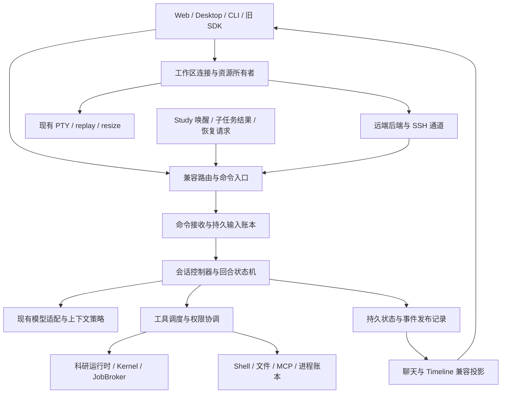

# OpenScience harness 重构审计与实施路线

日期：2026-09-24。状态：规划，尚未实施。适用对象：当前 Workspaces dev 版本。

## 1. 决策摘要

采用渐进替换：保留 OpenScience 的科研领域实现、模型适配、工具能力、桌面与 Web 技术栈；参考 ZCode 的命令接收、输入账本、回合状态机和快照投影，重构 OpenScience 的通用执行控制层。

第一目标是确定性：每条输入有回执、每次执行有所有者、每项副作用有明确结果、每次重连能够恢复正确界面。第二目标是响应性：权限、取消、队列操作不被模型请求、工具运行或界面聚合计算阻塞。之后才扩大并行和工作流能力。

不能用“换成 ZCode”替代这些目标。ZCode 的实现依赖其 Node、contracts、bootstrap、SQLite 和产品协议；直接搬入会引入第二套会话、权限、存储和事件系统。当前 OpenScience 也已有多进程锁、幂等回执、持久队列、进程账本和科研恢复机制，需要统一与保留。

推荐首先完成 P0—P4，获得稳定性和日常交互的主要提升；P5 优化工具调度与长任务；P6 才考虑更复杂的工作流。各阶段独立验收，不能用最后一次手工测试替代分阶段门禁。

## 2. 审计范围与证据等级

固定源码基线：

- OpenScience：`4d1b85670a49e6190a87ba170df2cb95950811e1`，即已发布安装包所指向的 dev 提交。
- ZCode：`328c1a0c0ffaa5a4f65e8fa199af5e4c20706e5f`，根项目 v3.14.3；Agent 子项目另有自己的版本号。
- 本轮开始时两边工作树均无未提交改动。ZCode 自带 freshness 检查通过；这是相对于本地 origin/main 的检查，不代表重新拉取了远端最新提交。

检查了命令入口、会话循环、引导/队列、事件回放、权限、压缩、科研唤醒、Timeline 投影/恢复、PTY 所有权、配置失效、会话删除和远程身份相关实现，并检查现有测试场景。此次没有运行完整测试套件、生产压测、真实模型对照评测或远端故障注入；下文性能数字是待建立基线后的验收目标，不是测得的现状。

“已确认”指代码中的结构与调用关系；“风险”指需通过跨模块测试复现的失效条件。不能将后者直接认定为现网故障根因。尤其不能由文件数量、代码量或注释中的“黄金测试”推断运行质量。

## 3. 已确认的架构与关键差异

| 领域       | 当前 OpenScience 的实际实现                                                                                                       | ZCode 可借鉴内容                                                            | 重构判断                                                   |
| ---------- | --------------------------------------------------------------------------------------------------------------------------------- | --------------------------------------------------------------------------- | ---------------------------------------------------------- |
| 命令入口   | Research composer 使用 runtime 协议；非 Research 和明确不支持协议的旧端走 session 路由；StudyDriver 直接调用 SessionPrompt.submit | CommandInbox 对命令接收、版本检查、去重、查询统一处理                       | 统一内部入口，保留外部兼容路由；不能只改 composer          |
| 输入与排队 | RuntimeRuns、RuntimeQueue 使用文件存储、租约、请求摘要、revision、barrier；运行中引导追加消息并加入现有 run                       | session_input 账本区分 admitted/promoted 等状态，promotion 与消息写入同事务 | 首先收口唯一写入者，再解决跨记录原子性                     |
| 执行状态   | RuntimeRuns、RuntimeEvents、SessionPrompt 控制器、SessionStatus、LoopState 各有相关状态                                           | TurnMachine 明确阶段和合法转换                                              | 统一权威生命周期，其他状态成为派生视图                     |
| 事件与 UI  | Bus 先实时分发，RuntimeEvents 在后方批量持久化；UI 仍大量消费旧 message/session 事件                                              | ProductProjection 将事件归约成快照与增量，冷启动复用投影                    | 保留低延迟文本流，补齐持久控制事实及一致恢复               |
| 自动恢复   | RuntimeRuns 对进程丢失记录 interrupted；project warmup 在 durable-jobs 开启时恢复未完成会话循环                                   | 冷会话恢复去重、输入恢复和协议状态明确分层                                  | 统一恢复策略，核验“读历史”和“恢复执行”的边界               |
| 权限       | RuntimeDecisions 持久化决策回执；PermissionNext 持有进程内 continuation，回复路径含 trace/授权写入                                | Broker、权限阶段、输入修改后复核、等待耗时归因                              | 保留科研授权规则；缩短非必要串行等待，不能先放行再记录授权 |
| Timeline   | 从 MessageV2/ToolPart 投影，通过 messageID + callID 关联 ExecutionHistory；恢复另建分支与内核                                     | 可重放的产品投影、稳定实体标识                                              | 冻结关联键及动作语义，逐步增加可重建索引                   |
| Terminal   | 后端 PTY 由 Instance.state 和 AuthorityProcessLedger 管理；前端按 sdk.scope 缓存，WS 使用专用 replay/resize 协议                  | 工作区身份与 Host/执行所有者的清晰分离                                      | 不并入聊天回合状态机，不用通用事件流承载 PTY 字节流        |
| 科研与算力 | StudyDriver、JobBroker、KernelRuntime、ExecutionHistory、预算及精确计划授权                                                       | 工作流依赖与受控并行的设计                                                  | 保留领域能力，通过受控接口接入统一控制层                   |

### 3.1 集中度与双入口风险

`session/prompt.ts` 当前 4,128 行，`processor.ts` 1,532 行，`compaction.ts` 1,072 行，`runtime/events.ts` 799 行。这里的问题不只是文件长，而是同一条链路混合接收、上下文、执行、科研策略、恢复与事件发布。

公开 runtime 已有“相同请求返回同一回执”的保护，但 StudyDriver 和旧路由并非全部经 RuntimeRuns 接收。只在 runtime 外围增加一个新队列，仍可能留下第二条控制路径。所有入口必须列入迁移清单，包括桌面、Web、CLI/headless、旧 SDK、子任务、科研唤醒、恢复、斜杠命令及 shell 模式。

### 3.2 恢复策略需要专门验收

`project/bootstrap.ts` 调用 `SessionPrompt.resumeInterrupted()`；后者在时间窗口内直接重新启动未结束主会话的 loop。公开 runtime 的恢复契约则强调进程丢失后中断、不自动重试外部效果。

这是已确认的两条代码路径，但尚未用同一崩溃场景复现它们是否产生状态矛盾。P0 必须覆盖“run 回执已 interrupted，但旧 transcript 仍有未完成 assistant”的组合，明确是否继续、由谁继续、使用什么新执行标识及权限。

### 3.3 Timeline 与 Terminal 的依赖完全不同

Timeline 不只是消息列表：它关联科研执行记录、内核代次、子会话、快照、分支、撤销和受限恢复。只保持页面能打开不算兼容。

Terminal 也不是 bash 工具的可视化窗口。它有独立 PTY、交互 shell、输出游标和窗口尺寸。停止模型不能顺带销毁用户终端；相反，项目/执行权限撤销需要继续按实际所有权关闭资源，不能为了“终端保活”绕过原有撤销机制。

### 3.4 不应照搬的 ZCode 细节

- 不迁移 React/Zustand、stdio 产品协议或整个 Agent 包；继续使用 SolidJS、当前 SDK、HTTP/SSE、PTY WebSocket。
- 不直接复制工具并行白名单及默认并发数。ZCode scheduler 对缺少名称和安全元数据的调用存在可并行分支；科研端未知副作用应保守串行，同一内核尤其如此。
- 不把 ZCode 冷会话 hydrate 当作可安全重放任意命令的证明。
- 不将 ZCode 的 SQLite 事务直接套在 OpenScience 现有 JSON 存储上。跨两种存储写入仍然不是一个事务。
- 不在第一轮同时替换模型 SDK、压缩算法、终端引擎和存储格式，否则无法区分行为变化来源。

## 4. 目标架构与状态所有者

以下模块名称为建议结构，不代表现有 API。

| 所有者                    | 权威状态                                                             | 不应负责                                   |
| ------------------------- | -------------------------------------------------------------------- | ------------------------------------------ |
| WorkspaceRuntime          | 工作区身份、连接代次、资源注册、配置版本、关闭/撤销                  | 推导模型是否完成、自动提交用户消息         |
| SessionController         | 当前 run/turn、阶段、取消、待处理决策、输入消费边界                  | 管理 PTY 字节缓冲、杀死不属于该 run 的进程 |
| CommandInbox / InputStore | commandID、payload 摘要、接收顺序、guide/queue 意图、回执、promotion | 等模型或整个工具执行完才释放接收锁         |
| ToolExecution             | callID、权限、执行租约、输出、终态、副作用结果是否确定               | 自行重放未知结果的写操作                   |
| ScientificRuntime         | 实验、预算、作业、内核、数据/产物血缘                                | 绕过统一入口唤醒第二个模型 loop            |
| ProjectionStore           | 可由持久事实重建的聊天/Timeline 读模型、游标                         | 启动作业、核准权限、维护第二套真实执行状态 |
| TerminalRuntime           | PTY、shell 环境、尺寸、字节游标、订阅者及所属资源范围                | 跟随模型配置更新或聊天回合结束而重建       |

关键规则：

1. 工作区身份与磁盘路径分离。身份包含后端/远端归属，不能只用 `/home/user/project`；连接重建有新 epoch，但工作区身份不因此改变。
2. session、run、turn、modelRequest、toolCall、command 各有稳定 ID；科研 job/execution/kernel incarnation 和 PTY ID 保持独立，通过显式字段关联。
3. 每个会话最多一个主执行控制器。子任务和科研作业可并发，但所有者和终态独立；旧 epoch 的取消、回复及事件不能命中新 owner。
4. 接收锁只覆盖验证、去重和持久化接收，不覆盖权限等待、模型网络请求或长工具执行。取消/权限有控制通道，不能排在等待它们的任务后方。
5. 状态更新只有一个权威写入者。兼容 message/session 事件是该写入的投影，不允许旧、新循环同时写同一会话。
6. 回执的 received、admitted、applied、completed 含义分开。前端可以立即反馈“正在提交”，但不能在持久接收前宣称已接受。
7. 幂等接收不等于任意外部副作用 exactly-once。崩溃后结果不明必须标记 unknown/interrupted、查询实际资源或等待显式恢复；禁止盲目重跑。

## 5. 必须冻结的兼容契约

### Timeline

- 保留 sessionID、messageID、partID、callID、assistant.parentID 的语义及旧记录可读性；新 turnID 不得直接替换 Timeline 现有分组键。
- 保留 `ExecutionHistory` 的 message/call 关联、queued/start/end 时间、kernel incarnation、executionID、资源与产物关系。
- 保留工具成功/错误/取消/中断映射、用户摘要脱敏、成本和 token 计数；重放不得重复累计费用或重复产生动作。
- 保留 message 游标分页、撤销边界、分支血缘、checkpoint 的预览/创建/恢复流程。后端字段可扩展，旧响应语义不能静默变化。
- Timeline 的“读取历史”和“恢复内核执行”必须是不同命令。现有恢复仅把校验通过的安全步骤写入独立分支；保持摘要校验、内核代次保护和需人工处理步骤。
- 面板切换优先展示已加载数据，再后台校验。按 workspace identity + sessionID + projection schema version 缓存，有容量上限；删除、撤销和分支操作精确失效，不能仅追加而遗留旧动作。

### Terminal

- 保留 `/pty` 及连接/尺寸更新契约、PTY 字节游标和 resize frame；不能拿聊天事件 sequence 代替 PTY offset。
- 模型配置修改、聊天停止、切换会话不应销毁无关 PTY 或重建终端模拟器。
- 长行、中文/宽字符、粘贴、窗口缩放、重连回放分别验收；禁止通过重复注入 shell 命令“恢复”屏幕。
- 权限撤销、删除会话/项目、应用关闭按资源所有权矩阵执行。会话拥有的 PTY 与项目拥有的 PTY 分别列明，不一概保活，也不一概清除。
- 不承诺完整后端进程重启后 PTY 继续存活。当前运行时不能保活的情况下，应准确标记终端已退出，并提供重新打开；连接瞬断可恢复时才恢复原 PTY。
- conda、shell 初始化、集群命令通路与沙箱策略沿用当前实现，不能借重构扩大宿主机权限。

### 科研、算力与扩展

- 保留 KernelRuntime、ExecutionHistory、StudyDriver/StudyLedger、JobBroker、SSH/Modal 适配、结果与产物接口。
- 保留精确计划摘要、环境变更授权、预算限制、进程身份/组清理、作业状态核验；界面“允许一次”不得变成全局通配许可。
- 普通机器、无调度器 Linux、Slurm HPC、无 conda 环境均有明确 capability；缺少命令报告不可用，不伪装成空集群或资源为零。
- 保留模型/effort/variant/context 及附件完整输入、工具 schema、MCP、plugin hooks、skills、子任务行为；拆分 loop 时维持插件调用顺序和输入输出约定。
- headless/Harbor 的 JSONL 合约、SDK 和旧服务能力协商纳入契约测试；不确定 POST 是否成功时禁止换路由重发。

## 6. 分阶段路线

### P0：冻结契约、建立可重现基线

依赖：无。优先级：最高。

交付：入口清单、状态/资源所有权矩阵、协议与历史记录 fixtures、固定 provider 录制/仿真流、性能采样、故障注入设施。使用脱敏夹具和独立数据目录；不对用户正式会话制造崩溃。

复用现有 `test/runtime`、`test/session/action-timeline.test.ts`、`timeline-recovery.test.ts`、`test/pty-*`、`test/remote`、命令运行多进程测试和前端 timeline/terminal 测试。补齐跨模块场景，尤其是当前测试分别通过但组合语义不同的路径。

退出条件：同一输入轨迹能重放出明确的消息、工具、权限、Timeline 和作业结果；记录稳定性/性能基线；所有既有失败都分类，不能把新增失败藏在基线失败中。

### P1：内部统一入口与生命周期隔离，保持执行算法

依赖：P0。

建议落点：`src/runtime/commands/`、`src/runtime/controller/`、现有 routes 与 `SessionPrompt` 之间的 facade。

交付：所有入口的命令分类与路由；内部 CommandEnvelope 携带身份、commandID、意图、目标 run/epoch；配置变更、会话取消、工作区销毁使用不同生命周期操作。先把旧 SessionPrompt 封装为唯一 execution adapter，不重写模型循环。

Research、旧 session 路由、CLI 和 StudyDriver 分批接入；明确不兼容的旧端保持原协议适配。控制命令不排在长执行后。关闭/删除保持现有 tombstone、authority revoke 和清理确认顺序。

退出条件：相同会话只有一个接收入口拥有写权限；删除与发送竞态可确定收口；配置更新与取消不关闭无关 Terminal；旧客户端用例全部通过。

回退：新建会话可选择旧 adapter，已启动执行不热切换。阶段内不改存储格式。

### P2：统一输入账本与可靠接收

依赖：P1。这是功能收益最高的一段。

交付：统一 start/guide/queue 的持久状态、查询回执、幂等摘要、FIFO 接收顺序、revision/epoch 检查、队列编辑/移除/暂停/恢复。用户引导、子任务结果、Study 唤醒标注不同 origin，科研自动输入不能伪装为新的人工授权。

语义：guide 在合法模型步骤边界生效；完整工具结果批次不能被拆开，纯文本结束边界也要处理待消费引导。queue 不进入当前模型上下文；成功终态后才按政策推进，失败/取消/重启维持显式暂停。保存提交时的模型、推理设置和附件意图，明确实际生效时点。

存储决策：P1 保留现有 JSON，P2 用一次独立 PoC 决定事务载体。推荐在确认本地文件系统适用后使用窄范围 SQLite 执行账本，将命令、输入、promotion、权威消息记录和待发布事件放在同一事务边界；兼容 JSON 成为可重建投影，不再是并列写入源。不能只把 queue 放进 SQLite，而声称 JSON transcript 已原子提交。

HPC 的用户数据可能位于 NFS 等共享文件系统：SQLite/WAL 的文件锁和部署位置必须验证。远端连接数、同目录多进程与掉电恢复须纳入 PoC。若部署不能满足，先采用明确的单写者 + 可恢复提交记录方案并保持旧存储；不能未经验证把数据库放在共享目录，也不为这次重构改迁全部科研数据。

退出条件：在接收后、promotion 中、消息落盘后、ACK 前逐点杀进程，同 commandID 不重复执行、不遗失输入；跨窗口冲突可查询；重启不自动推进危险操作。

回退：迁移前快照；会话级版本标记；只读旧格式适配。禁止新旧 writer 同写。已有新格式写入的会话不能靠关闭开关直接交给不认识该格式的旧版程序。

### P3：显式回合状态机与执行核心拆分

依赖：P2。

交付：把 `prompt.ts` / `processor.ts` 拆为输入准备、上下文构建、模型步骤、工具批次、决策等待、结束/恢复几个职责。先提取原逻辑和 ports，再替换控制分支；不同时更改系统提示、模型 SDK 和压缩算法。

建议阶段：preparing、requesting、streaming、waiting_permission、executing_tools、compacting、retry_wait、cancelling、completed/failed/cancelled/interrupted。并发工具的各自状态独立记录，会话摘要由这些事实派生，不能用一个枚举掩盖“部分工具运行、部分等待权限”。

统一配置版本和执行选择；模型能力变化在下一合法步骤生效；取消绑定 exact run/owner epoch。恢复分为历史 hydrate、重连订阅、科研作业 reattach、明确允许的继续执行，使用不同入口和政策。

退出条件：非法状态跳转被拒绝；迟到输出不能复活已取消回合；最后一条 guide 不被漏掉；工具调用及结果配对完整；异常重启和主动升级的恢复政策均通过组合测试。

### P4：事件、快照与 Timeline 投影

依赖：P2；执行语义以 P3 为准，可在 P3 期间先开发纯投影验证。

交付：有版本的快照、session epoch/revision、明确游标和控制事件；聊天与 Timeline 使用可重建读模型。首屏快照和之后增量有一致切点，游标过期需要新快照，不能静默跳过。

保持双层流：持久接收、权限、输入消费、工具终态等控制事实可靠提交；token delta 可以批量/临时传输，最终正文或 checkpoint 可校正。PTY 仍走专用通道。不要为了每个 token 都事务写入拖慢输出。

迁移期由唯一投影器生成旧 MessageV2 和 Bus 兼容事件。先验证同一轨迹的新旧 Timeline 投影等价，再迁移界面订阅；同一消费者不能无去重地同时应用两条事件流。

把 Timeline 汇总与行动页请求解耦，逐步从全窗口重拉改为按消息/执行记录增量失效；撤销、删除、分支和内核恢复必须能刷新受影响窗口。缓存不能成为事实源。

退出条件：重连无重复/漏动作，成本不重复累计；切换面板立即可见缓存；历史会话、分支、checkpoint、执行代次、分页和脱敏结果保持一致；慢 Timeline 消费者不会延迟权限回复和任务取消。

### P5：工具协调、科研接入与可解释的耗时

依赖：P3/P4 的控制与投影契约稳定。

交付：统一 ToolExecutionResult、工具权限协调、副作用元数据、取消/超时边界与结构化错误。保留现有 CommandRuntime、KernelRuntime、JobBroker、进程账本作为 adapter。

先维持当前执行顺序，再启用经验证的并行：同一 kernel incarnation、相同写资源或执行环境变更串行；不同只读资源可并行；未知能力默认串行。并发上限由资源与工作区限制决定，不照搬固定数值。

耗时拆分为 admission、permission_wait、prepare、provider_connect、first_output、tool_start、tool_run、output_drain、settlement。沿用现有 telemetry/BashLifecycle，再统一关联 command/run/call/job。不能把等待模型推理误报成命令执行，也不能把等待用户批准算进命令执行预算。

科研长作业用持久 job 标识与进度订阅；网络断开后先查询 job 状态。模型回合取消、停止子进程、停止远程调度作业是不同动作；不擅自将前者扩大为后两者。

退出条件：权限拒绝/允许竞态确定收口；同内核无并发污染；本地 shell/远端 shell/调度作业结果与原有科研记录一致；非 HPC 环境不依赖 Slurm；长任务停止反馈准确。

### P6：灰度发布、迁移旧会话与后续能力

依赖：P0—P5 门禁通过。

先固定模型/工具轨迹的离线差分，再隔离测试项目，再内部新会话，再空闲旧会话，最后默认启用。存量运行不原地更换引擎。

“影子验证”只运行 reducer、上下文组装和记录转换；禁止同时运行两个真实模型循环或两次真实工具调用。付费作业及外部写操作只能由一个引擎负责。

验证桌面安装/升级、Web、CLI/headless、Windows 本地、普通 Linux 远端及 HPC。若远端能力版本过旧，走明确的兼容路径或要求升级；不得将不确定的失败请求改投本地执行。

复杂 DAG、更多并行子智能体、自动化任务等在本轮稳定后单独立项。它们不是修复队列/权限/重连问题的前置条件。

## 7. 建议的提交顺序

| 批次 | 改动范围                                     | 可独立审查的结果                  |
| ---- | -------------------------------------------- | --------------------------------- |
| 01   | 契约 fixtures、入口/资源清单、采样与故障夹具 | 可重现基线                        |
| 02   | 命令 facade，旧循环 adapter                  | 不改执行算法的统一路由            |
| 03   | 生命周期分域、配置精确失效、删除协调         | Terminal 与无关资源保活           |
| 04   | 存储 PoC 与设计记录                          | 明确事务边界、NFS 限制、迁移/回退 |
| 05   | 输入账本、guide/queue、旧接口适配            | 接收与消费确定性                  |
| 06   | 状态机与 loop 职责拆分                       | 生命周期唯一所有者                |
| 07   | 取消、恢复、科研唤醒统一                     | 消除恢复旁路                      |
| 08   | 持久控制事件、快照、兼容投影                 | 前后端恢复一致                    |
| 09   | Timeline 增量与缓存                          | 保持全功能并改善切换体验          |
| 10   | 权限/工具协调与耗时归因                      | 控制延迟与执行可观测              |
| 11   | 受控并行与科研 job 接入验收                  | 可证明的吞吐提升                  |
| 12   | 会话迁移、安装包与远程混合版本验收           | 可灰度交付版本                    |

每批行为变更同步更新 spec、CHANGELOG、SDK/文档及相关测试；不靠一个巨大提交同时改变所有层。实际工作量以 P0 基线与 P2 存储 PoC 校准，不在没有测试数据时承诺固定完成日期。

## 8. 回归矩阵与验收门禁

| 场景组    | 必测场景                                                                 | 不可退让的结果                                   |
| --------- | ------------------------------------------------------------------------ | ------------------------------------------------ |
| 命令接收  | 双击、网络超时重试、同 ID 不同内容、跨窗口编辑、接收后崩溃               | 不重复副作用；冲突明确；输入可查询               |
| 引导/队列 | 模型首字等待中、工具批次中、纯文本结束边界、压缩中、权限等待中提交       | guide 有生效回执；queue 不污染当前回合；次序正确 |
| 权限/取消 | 两窗口同时回复、拒绝后迟到允许、停止旧 run、授权持久化失败               | 只裁决一次；旧决策不生效；不能错误展示已批准     |
| 恢复      | ACK 丢失、事件截断、连接新 epoch、服务重启、升级、崩溃后 job 已完成      | 快照一致；不重放结果不明的命令/作业              |
| Timeline  | 切换面板、历史分页、撤销、分支、导出/详情（按现有能力）、checkpoint 恢复 | ID/血缘/成本正确；脱敏保持；无重复行动           |
| Terminal  | 长行与中文、快速 resize、粘贴、重复 WS 连接、断线回放、切模/切会话       | 无字符覆盖/输出重复；不误关闭 PTY                |
| 科研      | Python/R、环境切换、相同内核并发、预算用尽、作业回调重复、Study 唤醒     | 环境/代次正确；不重复实验；预算/授权有效         |
| 远端      | 同路径不同主机、重连迟到握手、旧后端、普通 Linux、无 Slurm/conda、HPC    | 无身份串线；能力真实；不回退本地执行             |
| 删除      | 活跃模型/工具/PTY/内核时删会话或项目、清理中崩溃、再次清理               | tombstone 可恢复；无权限复活；无无关资源被杀     |

量化门禁建议（需 P0 固定硬件、模型仿真、数据量、并发数与网络条件）：

- 正确性：所有必测场景通过；每个新增风险窗口有行为测试；不依赖源码字符串断言。
- 本地已预热控制 API 的持久接收/权限回执 p95 目标 ≤250ms；界面提交反馈 ≤100ms。实际授权材料准备另计，但要显示阶段，不能假报已完成。
- 远端指标分开记录 RTT 和服务端处理时间；不对任意网络承诺固定端到端延迟。
- Timeline 已缓存切换 p95 目标 ≤100ms；冷启动与深历史分别采样。增加 1k/10k/100k 事件数据集，观察增长趋势而非只测空会话。
- 取消确认和取消完成分别计时；本地确认 p95 目标 ≤250ms。作业退出时间由工具/集群决定，未退出前不能显示已停止。
- 同轨迹成功率、TTFT 之外的框架耗时、token/cost、内存、事件积压、句柄/进程数均与基线比较；建议不接受无解释的 >10% 性能退化。
- 执行核心新增决策逻辑覆盖率目标 >80%，重点是状态转移/崩溃窗口与跨进程测试，不用覆盖率代替真实 PTY 和远程验收。
- 至少一次持续多会话运行与连接反复切换的浸泡测试，时长建议 8 小时；明确测量内存/句柄趋势。未执行不能写“健壮性已保证”。

现有后端测试从 `backend/cli` 使用固定 Bun 版本与 `bun test --timeout 15000 ./test/<area>`；前端、SDK、OpenAPI 生成和桌面打包按仓库现有脚本执行。新增故障注入只在独立测试目录；测试权限放宽不能沿用此前仅针对某个测试项目的一次性授权。

## 9. 回退与数据保护

- 每阶段保存迁移 manifest、schema version、会话 engine version 和可验证的迁移前快照；先复制真实结构的脱敏数据完成演练。
- 开关选择只对未运行会话生效；新 owner 接管必须验证旧 owner 已失效，不以固定等待时间猜测。
- 旧数据先支持只读/延迟迁移，保持消息和科研标识稳定。新数据若无法被旧版理解，回退需兼容导出并核对差异，或使用明确截止点的快照；不能悄悄丢失迁移后的消息。
- 科研产物、模型密钥、SSH known_hosts、用户配置与实验数据不因执行账本迁移被清空或重置。
- 达不到阶段门禁就保留旧默认路径；发布前关闭不完整能力，不在用户会话上试验恢复。

## 10. 源码索引

以下相对路径均从本仓库根目录定位；ZCode 位于相邻目录。行号会随未来实现变化，审计以本文件记录的提交为准。

OpenScience：

- [公开请求与接收](../../backend/cli/src/runtime/runs.ts)、[持久队列](../../backend/cli/src/runtime/queue.ts)、[决策回执](../../backend/cli/src/runtime/decisions.ts)、[事件日志](../../backend/cli/src/runtime/events.ts)。
- [前端提交能力协商](../../frontend/workspace/src/components/prompt-runtime.ts)、[runtime 路由](../../backend/cli/src/server/routes/runtime.ts)、[旧 session 路由](../../backend/cli/src/server/routes/session.ts)。
- [会话循环](../../backend/cli/src/session/prompt.ts)、[流式处理](../../backend/cli/src/session/processor.ts)、[压缩](../../backend/cli/src/session/compaction.ts)、[阶段观测](../../backend/cli/src/session/telemetry.ts)、[科研 harness](../../backend/cli/src/harness/index.ts)。
- [科研唤醒](../../backend/cli/src/experiments/driver.ts)、[项目预热恢复](../../backend/cli/src/project/bootstrap.ts)、[权限规则](../../backend/cli/src/permission/next.ts)、[会话删除](../../backend/cli/src/session/index.ts)。
- [Timeline 行动投影](../../backend/cli/src/session/action-timeline.ts)、[内核恢复](../../backend/cli/src/session/timeline-recovery.ts)、[前端控制器](../../frontend/workspace/src/atlas/timeline/controller.ts)、[面板订阅](../../frontend/workspace/src/atlas/timeline/ActionTimelinePane.tsx)。
- [PTY](../../backend/cli/src/pty/index.ts)、[终端缓存](../../frontend/workspace/src/context/terminal.tsx)、[终端组件](../../frontend/workspace/src/components/terminal.tsx)、[配置失效](../../backend/cli/src/config/config.ts)。
- [命令进程注册](../../backend/cli/src/science/command/registry.ts)、[bash 生命周期](../../backend/cli/src/tool/bash-lifecycle.ts)、[远端连接](../../backend/cli/src/remote/registry.ts)、[原子文件记录](../../backend/cli/src/storage/storage.ts)。

ZCode：

- [命令入口](../../../ZCode/apps/zcode-cli/packages/bootstrap/src/zcode-protocol-v4/command-inbox.ts)、[输入账本与事务 promotion](../../../ZCode/apps/zcode-cli/packages/adapters/src/storage/session-store/repositories/session-inputs.ts)。
- [回合状态机](../../../ZCode/apps/zcode-cli/packages/core/src/agent/turn-machine.ts)、[模型步骤循环](../../../ZCode/apps/zcode-cli/packages/core/src/runtime/methods/turn-loop.ts)、[引导消费](../../../ZCode/apps/zcode-cli/packages/core/src/runtime/methods/turn-guide-drain.ts)、[队列推进条件](../../../ZCode/apps/zcode-cli/packages/bootstrap/src/zcode-protocol-v4/queue-auto-drain.ts)。
- [产品投影](../../../ZCode/apps/zcode-cli/packages/bootstrap/src/zcode-protocol-v4/product-projection.ts)、[快照协议](../../../ZCode/packages/shared/src/zcode-protocol-v4/snapshot.ts)、[历史投影复用](../../../ZCode/apps/zcode-cli/packages/bootstrap/src/zcode-protocol-v4/replay.ts)。
- [工具调度](../../../ZCode/apps/zcode-cli/packages/core/src/tool/scheduler.ts)、[工具权限](../../../ZCode/apps/zcode-cli/packages/core/src/tool/executor/permission-flow.ts)、[工作区身份](../../../ZCode/packages/shared/src/remote-workspace-identity.ts)、[冷会话恢复](../../../ZCode/apps/zcode-cli/packages/bootstrap/src/zcode-protocol-v4/cold-session-resume.ts)。

该路线将工程质量技能中的“先明确状态与接口、分阶段验证、可替换边界”落实为契约和发布门禁。本轮仅增加规划文档，没有修改应用实现、用户数据或发布配置。
